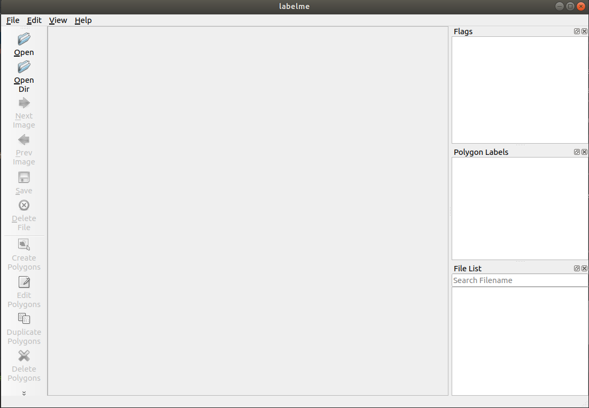
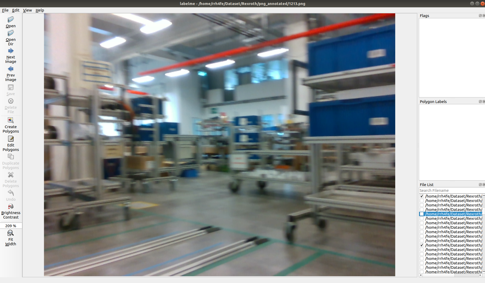
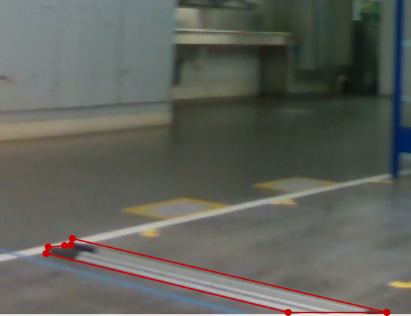
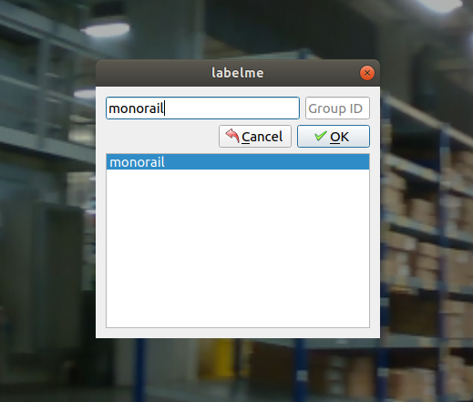
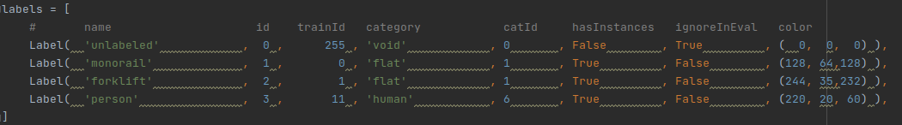

# Datasetcreator
## Custom Cityscapes like Dataset creation pipeline for Semantic Segmentation


### Pupose of the package:
1. Capture RGB images using a realsense camera and sample images from the captured images for creation of the dataset
2. Create the dataset for semantic segmentation from the selected images similar to Cityscapes dataset

### Clone the repo:
```git clone https://github.com/Eashwar93/Datasetcreator.git```

### Environment Setup:
1. Create a virtual environment either using venv or [anaconda](https://docs.anaconda.com/anaconda/install/linux/) and activate the same
```bash   
conda create -n dataset python=3.7
conda activate dataset
```
2. Use the following commands to install various dependencies for the package to work
```bash
pip install pyrealsense2
pip install opencv-contrib-python
pip install cityscapesScripts
pip install earthpy
```
### Workspace setup
You can create your own workspace but if you can just create a workspace using the below script 
it will work well with the default arguments with most of the scripts. Setup a workspace(recommended)
```bash
sh setup_workspace.sh
```

####Note : Please use the root directory of this repo to run the below commands. 
#### Running the scripts from a different directory might not work as the make use of relative paths
#### The below instructions also assume that you have setup the Workspace from the previous setup

### Step 1: Capture RGB images using a realsense camera 
1. I have included a default Json file with the repository in the ```configs``` directory, please make sure to replace it with the json file that will be parsed to the camera driver during launch
2. Please make sure that you have necessary resolution mentioned in Json file (default setting: 640 x 480)
3. Please make sure that the FPS at which the camera is set at tze necessary rate (default setting: 30)
4. Use the below command to record 

```bash
sh record_data.sh
```

Running this command will generate:  
+ A folder with timestamp containing RGB images from both cameras
+ A bag file of the RGB Video Stream of each camera separately with device_ids

### Step 2: Sample the captured data after capturing
Not all the image that are captured is needed to create a dataset. We can thereby perform sampling to reduce the data to a manageable number:
1. Please make the necessary modifications in the ```imagesampler.sh``` in the ```--imgs_path``` argument based on the directories created by the ```record_data.sh``` scripts
2. Optionally you can vary the ```--sample_rate``` argument which is by default set to 30.
3. No other changes is necessary if you are using the pipeline from the beginning
4. Use the following command to sample images

```bash
sh imagesampler.sh
```
Running this command will generate sampled images according to the sample rate. The numbering of the sampled images is taken care by the 
script and is sequential starting from ```0.png```

### Step 3: Add the sampled images to the master location
The master location for the dataset in considered as ```~/Dataset/Rexroth/png_annotated``` according to the workspace setup
1. Us the below command to copy the sampled images to the master location for the dataset
```bash
sh add_data.sh
```
2.Type in agree in the terminal if the number suggested by the program is greater than the existing filename in the master location 

Numbering is chosen as the name of the image files to maintain consistency in maintaining the dataset over a period of time

A manual confirmation is requested to avoid any kind of discrepancy as the master location for the dataset should be handled with extreme care.

Again the script will take care of the numbering while copying, and it will be sequential starting right after the largest existing filename

Deactivate the existing environment

```bash
conda deactivate dataset
```
### Step 4: Create Json files using labelMe, the polygon annotation tool
We need to set up new environment for this purpose as we have python package clashes
```bash
conda create -n labelme python=3.7
conda activate labelme
pip install labelme 
```
Please make yourself familiar with this [labelme](https://github.com/wkentaro/labelme) package 

####Note: We will be using the Labelme Package to create polygon Annotation which will further be processed to be made as the Dataset
1. Use the command labelme to open the polygon annotation tool
```bash
labelme
```
The following screen will appear. The toolbar in the left is self-explanatory which we will be making of to create json polygon annotations

2.Open the directory to which we have added data. In-case if you have setup the workspace as explained before, you should open the ```~/Dataset/Rexroth/png_annotated``` directory to start drawing polygons.

3. We have 3 categories at the moment in the Rexroth Dataset.
    1. monorail
    2. person
    3. forklift
    
and can be extended to further number of classes as the application grows
    
4. Use the following steps to create polygons
    1. Draw the polygon in the image covering the region which pertains to the object of interest
       
    2. Set a label to the drawn polygon
       
       
    3. Save the drawn polygon to a json file using ```Strg+S```. By default, the json file is named exactly as the image and please don't change the name of the file
   
5. Upon completion of polygon annotation for every image, you can once again inspect to make sure that there are no errors and close the labelme tool
6. Deactivate the ```labelme``` environment and activate the ```dataset```
```bash
conda deactivate labelme
conda activate dataset
```
### Step 5: Create Train Test data split

This step is performed to segregate the training and test data. The default proportion of train images is 0.8 meaning 80% of the images will allocated for training of the network and remaining will be allocated as test images
1. Use the command to perform the split of data
```bash
sh train_test_split.sh
```
2. Ensure that the following directories are created

+ ~/Dataset/Rexroth/images/train/ - Contains the training images
+ ~/Dataset/Rexroth/images/test/ - Contains the test images
+ ~/Dataset/Rexroth/labels/train/ - Contains the training images and corresponding json files 
+ ~/Dataset/Rexroth/labels/test/ - Contains the test images and corresponding json files

3. Also ensure that you have all the images and json files in ```~/Dataset/Rexroth/png_annotated```

### Step 6: Convert the json files to a different syntax
The Cityscapes label generation tool inputs a differently formatted json file to create semantic segmentation label data. 
Use the following scripts to convert all the json files in the labels directory

```bash
sh labelme2cityscapes.sh
```

### Step 7: Generate labels for semantic segmentation

Once the json files are reformatted, we can now generate the actual labels for semantic segmentation. We also need to ensure that the file in location ```/python_scripts/labels.py```

The image below shows a snippet from labels.py file which needs to be taken care ok


What this file does is assigns pixel values to the area within each polygon according to the polygon label that we assigned using labelme
    
+ Pixels not bound by any polygon will get the value 0
+ Pixels bound by the polygons labeled monorail will get the value 1
+ Pixels bound by the polygons labeled forklift will get the value 2
+ Pixels bound by the polygons labeled person will get the value 3

You can add more polygon label in the "names" and the coresspoing fields as your dataset grows.

#### Note: The field "id" decides the pixel values on the label and it is mandatory to start it from zero as this will be communicated to the Training pipeline at a later point in time

Use the below script to generate the label images
```bash
sh json2labelimg.sh
```

This script creates 3 additional images per image json file pair in the entire ```~/Dataset/Rexroth/labels``` directory
+ imgname_id.png - The actual label file that will be loaded to our mode trainer
+ imgname_color.png - A color visualisation of our labels since the actual labels cannot be visualized as the value of pixels vary from 0 to 3
+ img_name_trainid.png - A monochromatic visualisation of our labels based on trainID also for us to quickly have a visualisation

### Step 8: Create the annotation file
The purpose of this file is to match which image file corresponds to which labels file. This file is also fed to the training pipeline at a later point in time

Use the following command to generate the files

```bash
sh annocreator.sh
```

The above command generates the following files with default arguments
+ train.txt - References the train images to train labels
+ test.txt - References the test images to test labels

####Note: In-case you plan to modify the shell script annocreator.sh, the placement of ```/``` slashes is very critical and atmost care must be taken. Wrong references can throw error in the training pipeline  

### Step 9: Cleaning up

As a last step you can move the directory ```~/Dataset/Rexroth/png_annotated``` outside of ```~/Dataset/Rexroth``` and the resulting ```~/Dataset/Rexroth``` is the necessary dataset formatted completely ready and compatible with our training pipeline
####Note : It is advisible to create backup of the ```~/Dataset/Rexroth/png_annotated``` directory as a safe measure  

